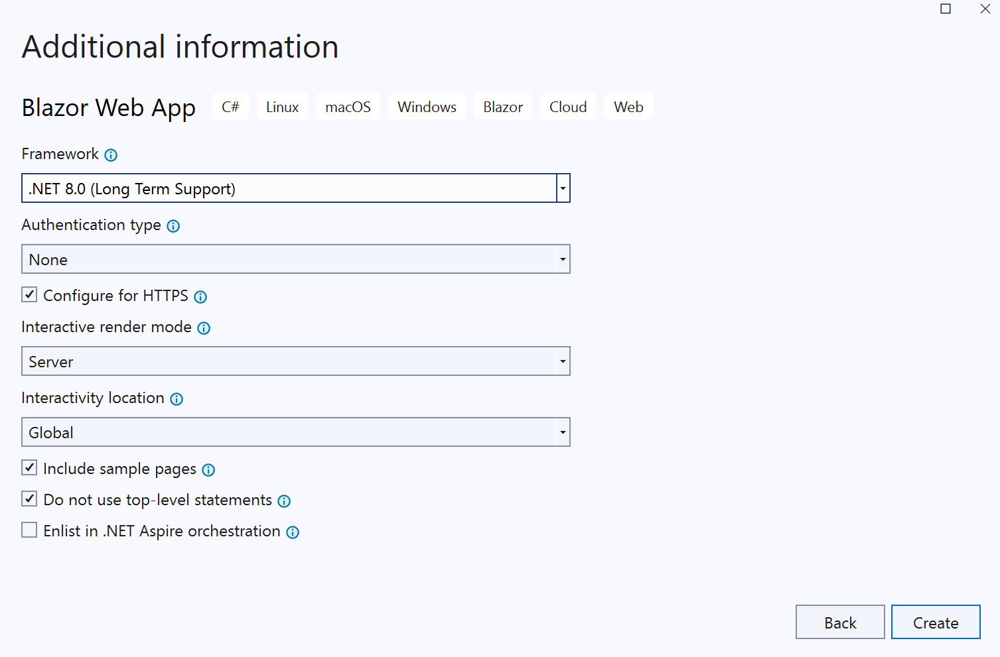

# Building the Front End

In this session, we'll add the front end web site, with a public (anonymous) home page showing the conference agenda.

## Add a FrontEnd project

We'll start by creating the new front end project for the web site.

### Adding the FrontEnd Project using Visual Studio

1. If using Visual Studio, right-click on the Solution and select **Add** > **New Project...**.
1. Select the *Blazor Web App* template. Name the project *FrontEnd* and press **OK**.
1. Select *ASP.NET Core 8.0 (LTS)* from the drop-down list in the top-left corner.
1. Set `Authentication type` to `Individual Accounts`
1. Make sure the `Configure for HTTPS` checkbox is checked
1. Set `Interactive render mode` to `Server`
1. Set `Interactivity location` to `Global`
2. Ensure `Include samples pages` and `Do not use top-level statements` is checked.
3. Click `Create`
4. Right-click on the *FrontEnd* project and select **Add** > **Project Reference**, then add a reference to the *ConferenceDTO* project.

   

### Adding the FrontEnd Project via the Command Line

1. Open a command prompt and navigate to the root `ConferencePlanner` directory.
1. Run the following command:

   ```bash
   dotnet new blazor --auth Individual --interactivity Server --all-interactive true --use-program-main true -o FrontEnd
   ```

1. Next we'll need to add a reference to the ConferenceDTO project from the new FrontEnd project. From the command line, navigate to the FrontEnd project directory and execute the following command:

   ```bash
   dotnet add reference ../ConferenceDTO/ConferenceDTO.csproj
   ```

## Create and wire-up an API service client

Our *FrontEnd* project has a reference to *ConferenceDTO*, but not *BackEnd*. The *FrontEnd* will communicate with the *BackEnd* using the HTTP endpoints. We'll create a common class to talk to our backend web API service using .NET's `HttpClient`.

### Create the API service client class

1. Create a folder called *Services* in the root of the *FrontEnd* project.
1. In this folder, add a new interface called `IApiClient` with the following members:

   ``` csharp
    using ConferenceDTO;

    namespace FrontEnd.Services;

    public interface IApiClient
    {
        Task<List<SessionResponse>> GetSessionsAsync();
        Task<SessionResponse?> GetSessionAsync(int id);
        Task<List<SpeakerResponse>> GetSpeakersAsync();
        Task<SpeakerResponse?> GetSpeakerAsync(int id);
        Task PutSessionAsync(Session session);
        Task<bool> AddAttendeeAsync(Attendee attendee);
        Task<AttendeeResponse?> GetAttendeeAsync(string name);
        Task DeleteSessionAsync(int id);
    }
   ```

1. Staying in this folder, add a new class called `ApiClient` that implements the `IApiClient` interface by using `HttpClient` to call out to our BackEnd API application and JSON serialize/deserialize the payloads:

   ``` csharp
    using System.Net;
    using ConferenceDTO;

    namespace FrontEnd.Services;

    public class ApiClient : IApiClient
    {
        private readonly HttpClient _httpClient;

        public ApiClient(HttpClient httpClient)
        {
            _httpClient = httpClient;
        }

        public async Task<bool> AddAttendeeAsync(Attendee attendee)
        {
            var response = await _httpClient.PostAsJsonAsync($"/api/Attendee", attendee);
            if (response.StatusCode == HttpStatusCode.Conflict)
            {
                return false;
            }
            response.EnsureSuccessStatusCode();
            return true;
        }

        public async Task<AttendeeResponse?> GetAttendeeAsync(string name)
        {
            if (string.IsNullOrEmpty(name))
            {
                return null;
            }
            var response = await _httpClient.GetAsync($"/api/Attendee/{name}");
            if (response.StatusCode == HttpStatusCode.NotFound)
            {
                return null;
            }
            response.EnsureSuccessStatusCode();
            return await response.Content.ReadFromJsonAsync<AttendeeResponse>();
        }

        public async Task<SessionResponse?> GetSessionAsync(int id)
        {
            var response = await _httpClient.GetAsync($"/api/Session/{id}");
            if (response.StatusCode == HttpStatusCode.NotFound)
            {
                return null;
            }
            response.EnsureSuccessStatusCode();

            return await response.Content.ReadFromJsonAsync<SessionResponse>();
        }

        public async Task<List<SessionResponse>> GetSessionsAsync()
        {
            var response = await _httpClient.GetAsync("/api/Session");
            response.EnsureSuccessStatusCode();
            return await response.Content.ReadFromJsonAsync<List<SessionResponse>>() ?? new();
        }

        public async Task DeleteSessionAsync(int id)
        {
            var response = await _httpClient.DeleteAsync($"/api/Session/{id}");
            if (response.StatusCode == HttpStatusCode.NotFound)
            {
                return;
            }
            response.EnsureSuccessStatusCode();
        }

        public async Task<SpeakerResponse?> GetSpeakerAsync(int id)
        {
            var response = await _httpClient.GetAsync($"/api/Speaker/{id}");
            if (response.StatusCode == HttpStatusCode.NotFound)
            {
                return null;
            }
            response.EnsureSuccessStatusCode();
            return await response.Content.ReadFromJsonAsync<SpeakerResponse>();
        }

        public async Task<List<SpeakerResponse>> GetSpeakersAsync()
        {
            var response = await _httpClient.GetAsync("/api/Speaker");
            response.EnsureSuccessStatusCode();
            return await response.Content.ReadFromJsonAsync<List<SpeakerResponse>>() ?? new();
        }

        public async Task PutSessionAsync(Session session)
        {
            var response = await _httpClient.PutAsJsonAsync($"/api/Session/{session.Id}", session);
            response.EnsureSuccessStatusCode();
        }
    }
   ```

### Configure the API client

1. Open the *Program.cs* file
1. Locate the line which reads  `var app = builder.Build();` and add the following code above it:

   ``` csharp
    builder.Services.AddHttpClient<IApiClient, ApiClient>(client =>
    {
        client.BaseAddress = new Uri(builder.Configuration["serviceUrl"]);
    });
   ```

  > This adds an instance of `HttpClientFactory` with its base URL pulled from the application configuration, which will point to our BackEnd API application.

1. Add a using statement for `FrontEnd.Services` to `Program.cs`.
1. Find the URL for your BackEnd API in the `BackEnd/Properties/launchSettings.json` file. It will be on a line that lists both an *http* and *https* URL - you want the *https* one. By default, you won't be running on IIS Express, so you don't need that URL.
1. Open the `appsettings.json` file in your *FrontEnd* project and add the configuration key for `serviceUrl` pointing to the URL your specific BackEnd API application is configured to run in. The result should look like this:

   ``` json
    {
    "ServiceUrl": "https://localhost:7112",
    "ConnectionStrings": {
        "DefaultConnection": "Server=(localdb)\\mssqllocaldb;Database=aspnet-FrontEnd-1d247878-c648-4656-93d9-6df0c76a5542;Trusted_Connection=True;MultipleActiveResultSets=true"
    },
    "Logging": {
        "LogLevel": {
        "Default": "Information",
        "Microsoft.AspNetCore": "Warning"
        }
    },
    "AllowedHosts": "*"
    }
   ```

ASP.NET Core has a rich configuration system. Often, simple configuration variables are stored in `appsettings.json` in development and overwritten by environment varibles or other configuration providers in production.

> **Warning**
> You should never store secrets like passwords, tokens, or database connection strings in `appsettings.json`. Secrets should be stored securely and outside of your application source code directory, for instance in the [Secret Manager](https://docs.microsoft.com/aspnet/core/security/app-secrets#secret-manager).

## List the sessions on the home page

Now that we have an API client we can use to talk to our BackEnd API application, we'll update the home page to show a basic list of all sessions for the conference to ensure the *FrontEnd* can talk to the *BackEnd* correctly.

### Load the data into the Home Razor component

The home page of the site will display our conference sessions. In ASP.NET Core Blazor, we use razor components to show UI. In our example, the default home page will serve the `Home.razor` Razor Component, which is located `Components\Pages\Home.razor`. Razor Components use a combination of a view template and a `@code` directive. These can either be in one file (such as `Home.razor`) or can be separated out (such as `Home.razor` and `Home.razor.cs`). You can also specify CSS styling at the component level as well, and can be inside the `.razor` file or a separate `.css` file(such as `Home.razor.css`). Inside the `@code` directive, we define the logic needed to render and interact with the component. To learn more about components, review the [official documentation](https://learn.microsoft.com/en-us/aspnet/core/blazor/components/). Here is the contents of the `Home.razor` component from the new project template.

```csharp
@page "/"

<PageTitle>Home</PageTitle>

<h1>Hello, world!</h1>

Welcome to your new app.
```

Here we see a `@page` directive that specifies the route that will load the component, as well some `html` along with a `PageTitle` component that will update the page title based on the value inside it. This example is quite minimal, for an example of a razor component that dynamically loads content, take a look at the `Weather.razor` component.

```csharp
@page "/weather"

<PageTitle>Weather</PageTitle>

<h1>Weather</h1>

<p>This component demonstrates showing data.</p>

@if (forecasts == null)
{
    <p><em>Loading...</em></p>
}
else
{
    <table class="table">
        <thead>
            <tr>
                <th>Date</th>
                <th>Temp. (C)</th>
                <th>Temp. (F)</th>
                <th>Summary</th>
            </tr>
        </thead>
        <tbody>
            @foreach (var forecast in forecasts)
            {
                <tr>
                    <td>@forecast.Date.ToShortDateString()</td>
                    <td>@forecast.TemperatureC</td>
                    <td>@forecast.TemperatureF</td>
                    <td>@forecast.Summary</td>
                </tr>
            }
        </tbody>
    </table>
}

@code {
    private WeatherForecast[]? forecasts;

    protected override async Task OnInitializedAsync()
    {
        // Simulate asynchronous loading to demonstrate a loading indicator
        await Task.Delay(500);

        var startDate = DateOnly.FromDateTime(DateTime.Now);
        var summaries = new[] { "Freezing", "Bracing", "Chilly", "Cool", "Mild", "Warm", "Balmy", "Hot", "Sweltering", "Scorching" };
        forecasts = Enumerable.Range(1, 5).Select(index => new WeatherForecast
        {
            Date = startDate.AddDays(index),
            TemperatureC = Random.Shared.Next(-20, 55),
            Summary = summaries[Random.Shared.Next(summaries.Length)]
        }).ToArray();
    }

    private class WeatherForecast
    {
        public DateOnly Date { get; set; }
        public int TemperatureC { get; set; }
        public string? Summary { get; set; }
        public int TemperatureF => 32 + (int)(TemperatureC / 0.5556);
    }
}
```

In this example, whenever the `/weather` route is called, it will load this component. When the component renders, the `OnInitializedAsync` method is called, which similar to the weather example from the Api sample earlier, will return some weather data. The objects defined in the `@code` directive are then referenced in the Razor markup using the directives (for instance `@if` and `@foreach`).

To start with, the `OnInitializedAsync` method's job will be to load all the sessions using the `ApiClient`. For our display purposes, we want to allow browsing through the conference sessions grouped by day and ordered by start time. We'll do that using standard LINQ methods.

1. Open the `/Pages/Home.razor` file
2. Add the following directives to the top of the file.

```csharp
@page "/{day:int?}"
@page "/Home/{day:int?}"
@using FrontEnd.Services
@rendermode InteractiveServer
@inject IApiClient _apiClient
@inject ILogger<Home> Logger
```

The above code sets the route of this component to be loaded for the `/` root path, as well as the `/Home` path. We also use Dependency Injection to inject instances of `IApiClient` (we have a `@using FrontEnd.Services` directive to avoid directly referencing) and `ILogger<Home>` into the component. Additionally we define optional parameters on the component called `day` which will act as the day we want to render sessions for. So in this case, we could have a route like `/1` or `/Home/2` and we can use that value in our `@code` directive.

1. Add some properties to the `@code` directive to store sessions and other data we'll need when rendering the page (adding a `@using ConferenceDTO` directive to resolve the compiler error):

   ``` csharp
   [Parameter] public int Day { get; set; }

   private IEnumerable<IGrouping<DateTimeOffset?, SessionResponse>> groupedSessions { get; set; } = new List<IGrouping<DateTimeOffset?, SessionResponse>>();

   private IEnumerable<(int Offset, DayOfWeek? DayofWeek)> dayOffsets { get; set; } = new List<(int Offset, DayOfWeek? DayofWeek)>();

   public int CurrentDayOffset { get; set; }
   ```

2. Add a lifecycle event to handle when the component is requested that loads the session data and calculates the data required to build the day navigation UI:

   ``` csharp
   protected override async Task OnInitializedAsync()
   {
       var sessions = await _apiClient.GetSessionsAsync();

       CurrentDayOffset = Day;

       var startDate = sessions.Min(s => s.StartTime?.Date);

       dayOffsets = sessions.Select(s => s.StartTime?.Date)
                             .Distinct()
                             .OrderBy(d => d)
                             .Select(d => ((int)Math.Floor((d!.Value - startDate)?.TotalDays ?? 0),
                                             d?.DayOfWeek))
                             .ToList();

       var filterDate = sessions.Min(s => s.StartTime?.Date)?.AddDays(CurrentDayOffset);

       groupedSessions = sessions.Where(s => s.StartTime?.Date == filterDate)
                           .OrderBy(s => s.TrackId)
                           .GroupBy(s => s.StartTime)
                           .OrderBy(g => g.Key);
   }
   ```

### Render the sessions list on the home page

Now that we have loaded the sessions into the razor component's properties, we can render them in the page.

1. Open the `/Pages/Home.razor` Razor component
2. Replace the `<div>` containing the welcome message with the following Razor markup to show the sessions as a simple list, grouped by time-slot:

   ``` html
   <div class="agenda">
       <h1>My Conference @System.DateTime.Now.Year</h1>

       @foreach (var timeSlot in groupedSessions)
       {
           <h4>@timeSlot.Key?.ToString("HH:mm")</h4>
           <ul>
               @foreach (var session in timeSlot)
               {
                   <li>@session.Title</li>
               }
           </ul>
       }
   </div>
   ```

3. Right-click the solution, select **Properties** and set both *BackEnd* and *FrontEnd* as startup projects.
4. Run the *FrontEnd* application at this stage and we should see the sessions listed on the home page

> Creating multiple startup projects in VS Code can be done by updating the `launch.json` file with the *compounds* part. Here is an example `launch.json` file which will run both projects and display the Swagger page for the *BackEnd* project.

```json
{
    "version": "0.2.0",
    "configurations": [
        {
            "name": "BackEnd",
            "type": "coreclr",
            "request": "launch",
            "preLaunchTask": "build",
            "program": "${workspaceFolder}/BackEnd/bin/Debug/net8.0/BackEnd.dll",
            "args": [],
            "cwd": "${workspaceFolder}/BackEnd",
            "stopAtEntry": false,
            "serverReadyAction": {
                "action": "openExternally",
                "pattern": "\\bNow listening on:\\s+http://\\S+:([0-9]+)",
                "uriFormat": "http://localhost:%s/swagger/index.html"
            },
            "env": {
                "ASPNETCORE_ENVIRONMENT": "Development"
            }
        },
        {
            "name": "FrontEnd",
            "type": "coreclr",
            "request": "launch",
            "preLaunchTask": "build",
            "program": "${workspaceFolder}/FrontEnd/bin/Debug/net8.0/FrontEnd.dll",
            "args": [],
            "cwd": "${workspaceFolder}/FrontEnd",
            "stopAtEntry": false,
            "serverReadyAction": {
                "action": "openExternally",
                "pattern": "\\bNow listening on:\\s+http://\\S+:([0-9]+)",
            },
            "env": {
                "ASPNETCORE_ENVIRONMENT": "Development"
            }
        },
        {
            "name": ".NET Core Attach",
            "type": "coreclr",
            "request": "attach"
        }
    ],
    "compounds": [
        {
            "name": "FrontEnd/BackEnd",
            "configurations": [
                "BackEnd",
                "FrontEnd"
            ]
        }
    ]
}
```

### Add buttons to allow showing sessions for different days

Like mentioned above, the component has an optional parameter called `Day` that acts of the day of the conference (for instance 0 is Day 1). We want the user to be able to change the day of the conference to see the full schedule. To do that, let's add buttons to allow the user to show sessions for the different days of the conference.

1. In `/Pages/Home.razor`, add the following markup , below the `<PageTitle>` component:

    ``` html
    <ul class="nav nav-pills mb-3">
        @foreach (var day in dayOffsets)
        {
            <li role="presentation" class="nav-item">
                <a style="cursor:pointer" class="nav-link @(CurrentDayOffset == day.Offset ? "active" : null)" @onclick="@(() => ChangeDate(day.Offset))">@day.DayofWeek?.ToString()</a>
            </li>
        }
    </ul>
    ```

We're using *Bootstrap* attributes like `nav` and `mb-3` to style the content.

What's interesting here is how we actually update the schedule. When a user clicks the anchor tag, we are calling a method called `ChangeDate()` that accepts the `day.Offset` variable. Let's see what that method looks like

```csharp
private void ChangeDate(int offset)
{
    CurrentDayOffset = offset;
}
```

As you can see, we update the `CurrentDayOffset` property that is used as part of the filtering of sessions from above. In order to plug this date change functionality into our component, we will need to refactor out the filtering so we can call it not only when the component is initialized, but also when a user clicks a new day. To do that, let's create a new method

```csharp
private void PopulateAgenda()
{
    var filterDate = sessions.Min(s => s.StartTime?.Date)?.AddDays(CurrentDayOffset);

    groupedSessions = sessions.Where(s => s.StartTime?.Date == filterDate)
                              .OrderBy(s => s.TrackId)
                              .GroupBy(s => s.StartTime)
                              .OrderBy(g => g.Key);
}
```

We moved the code that filters the sessions to a shared method. We will also need to have a "shared" session object to hold all the sessions for the event.

```csharp
private List<SessionResponse> sessions { get; set; } = new List<SessionResponse>();
```

Now whenever the `PopulateAgenda` method is called, it will update that property. Finally, we will need to update the `OnInitializedAsync` handler and `ChangeDate` method to use this new approach. The final `@code` directive should look like this

```csharp
@code {
    [Parameter] public int Day { get; set; }

    private IEnumerable<IGrouping<DateTimeOffset?, SessionResponse>> groupedSessions { get; set; } = new List<IGrouping<DateTimeOffset?, SessionResponse>>();

    private IEnumerable<(int Offset, DayOfWeek? DayofWeek)> dayOffsets { get; set; } = new List<(int Offset, DayOfWeek? DayofWeek)>();

    public int CurrentDayOffset { get; set; }

    private List<SessionResponse> sessions { get; set; } = new List<SessionResponse>();

    protected override async Task OnInitializedAsync()
    {
        sessions = await _apiClient.GetSessionsAsync();

        CurrentDayOffset = Day;

        var startDate = sessions.Min(s => s.StartTime?.Date);

        dayOffsets = sessions.Select(s => s.StartTime?.Date)
                             .Distinct()
                             .OrderBy(d => d)
                             .Select(d => ((int)Math.Floor((d!.Value - startDate)?.TotalDays ?? 0),
                                             d?.DayOfWeek))
                             .ToList();

        PopulateAgenda();
    }

    private void ChangeDate(int offset)
    {
        CurrentDayOffset = offset;
        PopulateAgenda();
    }

    private void PopulateAgenda()
    {
        var filterDate = sessions.Min(s => s.StartTime?.Date)?.AddDays(CurrentDayOffset);

        groupedSessions = sessions.Where(s => s.StartTime?.Date == filterDate)
                           .OrderBy(s => s.TrackId)
                           .GroupBy(s => s.StartTime)
                           .OrderBy(g => g.Key);
    }
}
```

As each button is rendered, the logic determines if it is the active day and sets the `active` attribute, causing *Bootstrap* to style it as such.

1. Run the application again and try clicking the buttons to show sessions for the different days.

## Update the sessions list UI

1. Make the list of sessions better looking by updating the markup to use [Bootstrap cards](https://getbootstrap.com/docs/5.1/components/card/). Update the html for the `Home.razor` component to below:

   ``` html
   <div class="agenda">
        @foreach (var timeSlot in groupedSessions)
        {
            <h4>@timeSlot.Key?.ToString("HH:mm")</h4>
            <div class="row">
                @foreach (var session in timeSlot)
                {
                    <div class="col-md-3 mb-4">
                        <div class="card shadow session h-100">
                            <div class="card-header">@session.Track?.Name</div>
                            <div class="card-body">
                                <h5 class="card-title"><a href="/Session/@session.Id">@session.Title</a></h5>
                            </div>
                            <div class="card-footer">
                                <ul class="list-inline mb-0">
                                    @foreach (var speaker in session.Speakers)
                                    {
                                        <li class="list-inline-item">
                                            <a href="Speaker/@speaker.Id">@speaker.Name</a>
                                        </li>
                                    }
                                </ul>
                            </div>
                        </div>
                    </div>
                }
            </div>
        }
    </div>
   ```

Next we will update the page level styling of the app to use bootstrap. Update the `Components/Layout/MainLayout.razor` component to below

```html
@inherits LayoutComponentBase

<div class="container">
    <main role="main" class="pb-3">
        @Body
    </main>
</div>

<footer class="border-top footer text-muted">
    <div class="container">
        &copy; @DateTime.Now.Year - My Conference
    </div>
</footer>
```

And add new styling to the `MainLayout.razor.css` file

```css
.page {
    position: relative;
    display: flex;
    flex-direction: column;
}

main {
    flex: 1;
}

.sidebar {
    background-image: linear-gradient(180deg, rgb(5, 39, 103) 0%, #3a0647 70%);
}

.top-row {
    background-color: #f7f7f7;
    border-bottom: 1px solid #d6d5d5;
    justify-content: flex-end;
    height: 3.5rem;
    display: flex;
    align-items: center;
}

    .top-row ::deep a, .top-row ::deep .btn-link {
        white-space: nowrap;
        margin-left: 1.5rem;
        text-decoration: none;
    }

        .top-row ::deep a:hover, .top-row ::deep .btn-link:hover {
            text-decoration: underline;
        }

        .top-row ::deep a:first-child {
            overflow: hidden;
            text-overflow: ellipsis;
        }

@media (max-width: 640.98px) {
    .top-row {
        justify-content: space-between;
    }

        .top-row ::deep a, .top-row ::deep .btn-link {
            margin-left: 0;
        }
}

@media (min-width: 641px) {
    .page {
        flex-direction: row;
    }

    .sidebar {
        width: 250px;
        height: 100vh;
        position: sticky;
        top: 0;
    }

    .top-row {
        position: sticky;
        top: 0;
        z-index: 1;
    }

        .top-row.auth ::deep a:first-child {
            flex: 1;
            text-align: right;
            width: 0;
        }

    .top-row, article {
        padding-left: 2rem !important;
        padding-right: 1.5rem !important;
    }
}

#blazor-error-ui {
    background: lightyellow;
    bottom: 0;
    box-shadow: 0 -1px 2px rgba(0, 0, 0, 0.2);
    display: none;
    left: 0;
    padding: 0.6rem 1.25rem 0.7rem 1.25rem;
    position: fixed;
    width: 100%;
    z-index: 1000;
}

    #blazor-error-ui .dismiss {
        cursor: pointer;
        position: absolute;
        right: 0.75rem;
        top: 0.5rem;
    }
```

1. Run the page again and see the updated sessions list UI. Click the buttons again to show sessions for the different days.

> **Note**
> The sessions and speakers appear as links, but those links aren't hooked up yet. We'll implement those next.

## Add a session details page

Now that we have a home page showing all the sessions, we'll create a page to show all the details of a specific session.

### Add a Session Razor Page

1. Add a new Razor Component using the *Razor Component* template. Call the page 'Session.razor' and save it in the */Pages* directory.
2. Set the `@page` directive to allow an optional `sessionId` similar to `Home.razor`
3. Inject a `IApiClient` and `NavigationManager` instance. Be sure to include `@using` directives.

``` csharp
   @page "/Session/{sessionId:int?}"
   @using ConferenceDTO
   @using FrontEnd.Services
   @rendermode InteractiveServer
   @inject IApiClient ApiClient
   @inject NavigationManager NavigationManager
```

> **Note** `NavigationManager` is a component to simply the process to navigate a Blazor application. We will use this later.

4. Add the `@code` directive to include the optional `sessionId` parameter, properties of the component, as well as the `OnInitializedAsync` handler.

   ``` csharp
   @code {
       [Parameter] public int SessionId { get; set; }
       public SessionResponse? SelectedSession { get; set; }
       public int? DayOffset { get; set; }

       protected override async Task OnInitializedAsync()
       {
           if (SessionId != null && SessionId != 0)
           {
               SelectedSession = await ApiClient.GetSessionAsync(SessionId);

               if (SelectedSession == null)
               {
                   NavigationManager.NavigateTo("/");
               }
               else
               {
                   var allSessions = await ApiClient.GetSessionsAsync();
                   var startDate = allSessions.Min(s => s.StartTime?.Date);
                   DayOffset = SelectedSession.StartTime?.Subtract(startDate ?? DateTimeOffset.MinValue).Days;
               }
           }
           else
           {
               NavigationManager.NavigateTo("/");
           }
       }
   }
   ```

    The code in `OnInitializedAsync` checks if there is a parameter passed to the component, get that session using `ApiClient` and in the case the parameter us not present OR the session does not exist in the database, use `NavigationManager` to redirect to the root of the app (which in our case is `Home.razor`). If the session does exist, we set the offset so we can identify what day of the conference the session is via breadcrumbs.


5. Add markup to show information related to session. The contents of `Session.razor` should look like the following:

   ``` csharp
   @if (SelectedSession != null)
   {

       <ol class="breadcrumb">
           <li class="breadcrumb-item"><a href="/">Agenda</a></li>
           <li class="breadcrumb-item"><a href="/@DayOffset">Day @(DayOffset + 1)</a></li>
           <li class="breadcrumb-item active">@SelectedSession!.Title</li>
       </ol>

       <h1>@SelectedSession.Title</h1>
        <span class="label label-default">@SelectedSession.Track?.Name&nbsp;</span>

       @foreach (var speaker in SelectedSession.Speakers)
       {
           <em><a href="/Speaker/@speaker.Id">@speaker.Name</a>&nbsp;</em>
       }

       @foreach (var para in SelectedSession!.Abstract!.Split("\r\n", StringSplitOptions.RemoveEmptyEntries))
       {
           <p>@para</p>
       }
   }
   ```

## Add a page to show speaker details

We'll next add a page to show details for a given speaker. The process to create the component is the same, so follow the steps above to create a new component called `Speaker.razor`. The `@code` directive and html markup are quite similar, and should look something like this:

   ``` csharp
@page "/Speaker/{speakerId:int?}"
@using ConferenceDTO
@using FrontEnd.Services

@inject IApiClient ApiClient
@inject NavigationManager NavigationManager
@if (SelectedSpeaker != null)
{
    <ol class="breadcrumb">
        <li class="breadcrumb-item"><a href="/Speakers">Speakers</a></li>
        <li class="breadcrumb-item active">@SelectedSpeaker!.Name</li>
    </ol>

    <h2>@SelectedSpeaker.Name</h2>

    <p>@SelectedSpeaker.Bio</p>

    if (SelectedSpeaker.Sessions != null)
    {
        <h3>Sessions</h3>
        @if (SelectedSpeaker.Sessions.Count > 0)
        {
            <div class="row">
                <div class="col-md-5">
                    <ul class="list-group">
                        @foreach (var session in SelectedSpeaker.Sessions)
                        {
                            <li class="list-group-item">
                                <a href="/Session/@session.Id">@session.Title</a>
                            </li>
                        }
                    </ul>
                </div>
            </div>
        }
    }
}
@code {

    [Parameter] public int SpeakerId { get; set; }

    public SpeakerResponse? SelectedSpeaker { get; set; }

    protected override async Task OnInitializedAsync()
    {
        if (SpeakerId != null && SpeakerId != 0)
        {
            SelectedSpeaker = await ApiClient.GetSpeakerAsync(SpeakerId);
        }
        else
        {
            NavigationManager.NavigateTo("/Speakers");
        }
    }
}
   ```

## Add page to list all speakers

Since we have a page to show individual speakers, it makes sense to have a page just for speakers. We could update the `Speaker.razor` component to list all speakers, but instead, let's create a new component called `Speakers.razor` that will list all speakers similar to how sessions are listed. That file will look like this.

```csharp
@page "/Speakers"
@using ConferenceDTO
@using FrontEnd.Services

@inject IApiClient ApiClient
@inject NavigationManager NavigationManager

<h1 class="mb-4">Speakers</h1>

@if (AllSpeakers != null)
{
    <div class="agenda">

        @foreach (var speakerLetter in AllSpeakers)
        {
            <h4>@speakerLetter.Key.ToUpper()</h4>
            <div class="row">
                @foreach (var speaker in speakerLetter)
                {
                    <div class="col-md-3 mb-4">
                        <div class="card shadow session h-100">
                            <div class="card-header">@speaker.Name</div>
                            <div class="card-body">
                                <h5 class="card-title"><a href="/Speaker/@speaker.Id">@speaker.Name</a></h5>
                            </div>
                            <div class="card-footer">
                            </div>
                        </div>
                    </div>
                }
            </div>
        }

    </div>
}
@code {

    public IEnumerable<IGrouping<string, SpeakerResponse>> AllSpeakers { get; set; } = null!;

    protected override async Task OnInitializedAsync()
    {
        var speakers = await GetSpeakersAsync();

        AllSpeakers = speakers.GroupBy(x => x.Name.First().ToString(), StringComparer.InvariantCultureIgnoreCase).OrderBy(a=> a.Key);
    }

    protected virtual Task<List<SpeakerResponse>> GetSpeakersAsync()
    {
        return ApiClient.GetSpeakersAsync();
    }
}
```

## Add search functionality

We'll add a page to allow users to search the conference agenda, finding sessions and speakers that match the supplied search term. This will require work on every part of our application - the *BackEnd* will process the search, the *FrontEnd* will display it, and both will use new classes in the *ConferenceDTO* library.

### Add DTO for search results

1. Add a new DTO class `SearchResult` in the DTO project:

   ```csharp
    namespace ConferenceDTO;

    public record SearchResult
    {
        public SearchResultType Type { get; set; }
        public SessionResponse? Session { get; set; }
        public SpeakerResponse? Speaker { get; set; }
    }

    public enum SearchResultType
    {
        Session,
        Speaker
    }
   ```

### Add a search endpoint

1. Add a `SearchEndpoints` class to the *Endpoints* directory in the *BackEnd* project. It just has one endpoint that accepts a search term and searchs for sessions and speakers with matching titles or names, and concatenates the results as a `List<SearchResult>`:

   ```csharp
    using BackEnd.Data;
    using ConferenceDTO;
    using Microsoft.EntityFrameworkCore;

    namespace BackEnd.Endpoints
    {
        public static class SearchEndpoints
        {
            public static void MapSearchEndpoints(this IEndpointRouteBuilder routes)
            {
                routes.MapGet("/api/Search/{term}", async (string term, ApplicationDbContext db) =>
                {
                    var sessionResults = await db.Sessions.Include(s => s.Track)
                                            .Include(s => s.SessionSpeakers)
                                            .ThenInclude(ss => ss.Speaker)
                                            .Where(s =>
                                                s.Title!.Contains(term) ||
                                                s.Track!.Name!.Contains(term)
                                            )
                                            .ToListAsync();

                    var speakerResults = await db.Speakers.Include(s => s.SessionSpeakers)
                                            .ThenInclude(ss => ss.Session)
                                            .Where(s =>
                                                s.Name!.Contains(term) ||
                                                s.Bio!.Contains(term) ||
                                                s.WebSite!.Contains(term)
                                            )
                                            .ToListAsync();

                    var results = sessionResults.Select(s => new SearchResult
                    {
                        Type = SearchResultType.Session,
                        Session = s.MapSessionResponse()
                    })
                    .Concat(speakerResults.Select(s => new SearchResult
                    {
                        Type = SearchResultType.Speaker,
                        Speaker = s.MapSpeakerResponse()
                    }));

                    return results
                        is IEnumerable<SearchResult> model
                            ? Results.Ok(model)
                            : Results.NotFound();
                })
                .WithTags("Search")
                .WithName("GetSearchResults")
                .Produces<IEnumerable<SearchResult>>(StatusCodes.Status200OK)
                .Produces(StatusCodes.Status404NotFound);
            }
        }
    }
   ```

2. Add `MapSearchEndpoints` extension to the `WebApplication` instance in `Program.cs`

```csharp
    app.MapSearchEndpoints();
```

### Add search methods to the IApiClient

1. Add the `SearchAsync` method to `IApiClient`:

   ```csharp
   Task<List<SearchResult>> SearchAsync(string query);
   ```

1. Add the implementation to `ApiClient`:

   ```csharp
    public async Task<List<SearchResult>> SearchAsync(string term)
    {
        var response = await _httpClient.GetAsync($"/api/search/{term}");
        response.EnsureSuccessStatusCode();
        return await response.Content.ReadFromJsonAsync<List<SearchResult>>() ?? new();
    }
   ```

### Add a search page to the Front End

1. Add a new Razor Component using the *Razor Component* template. Call the page `Search.razor` and save it in the */Pages* directory.
1. Set the `@page` directive to `Search` and inject `ApiClient:

   ``` csharp
   @page "/Search"
   @using ConferenceDTO
   @using FrontEnd.Services

   @inject IApiClient ApiClient
   ```

2. In the `@code` directive, add the `OnInitializedAsync` handler that calls into a private method `SearchSesions` that calls the newly created `ApiClient.SearchAsync` method:

   ``` csharp
   @code {

       public string Term { get; set; } = String.Empty;

       public List<SearchResult> SearchResults { get; set; } = new();

       protected override async Task OnInitializedAsync()
       {
           await SearchSessions();
       }


       private async Task SearchSessions()
       {
           if (!string.IsNullOrWhiteSpace(Term))
           {
               SearchResults = await ApiClient.SearchAsync(Term);
           }
       }
   }
   ```

3. To finish, add the markup for the search page UI:

   ``` html
    <div class="search">
    <h1>Search</h1>
    <div class="input-group mb-3">
        <input @bind="@Term" placeholder="Search for sessions or speakers..." class="form-control" />
        <div class="input-group-append">
            <button class="btn btn-outline-secondary" @onclick="SearchSessions">Go!</button>
        </div>
    </div>
    @if (SearchResults?.Count > 0)
    {
        <p>
            @SearchResults.Count result(s)
        </p>
    }
   </div>

   <div class="row">
    @foreach (var result in SearchResults!)
    {
        <div class="col-md-12">
            @switch (result.Type)
            {
                case SearchResultType.Speaker:
                    <div class="card shadow mb-3">
                        <div class="card-header">
                            <h3 class="card-title">
                                Speaker:
                                <a href="/Speaker/@result.Speaker.Id">
                                    @result.Speaker!.Name
                                </a>
                            </h3>
                        </div>
                        <div class="card-body">
                            <p>
                                @foreach (var session in result.Speaker.Sessions)
                                {
                                    <a href="/Session/@session.Id">
                                        <em>@session.Title</em>
                                    </a>
                                }
                            </p>
                            <p>
                                @result.Speaker.Bio
                            </p>
                        </div>
                    </div>
                    break;

                case SearchResultType.Session:
                    <div class="card shadow mb-3">
                        <div class="card-header">
                            <h3 class="card-title">
                                Session:
                                <a href="/Session/@result.Session.Id">@result.Session!.Title</a>
                            </h3>
                            @foreach (var speaker in result.Session.Speakers)
                            {
                                <a href="/Speaker/@speaker.Id">
                                    <em>@speaker.Name</em>
                                </a>
                            }
                        </div>
                        <div class="card-body">
                            <p>
                                @result.Session.Abstract
                            </p>
                        </div>
                    </div>
                    break;
            }
        </div>
    }
   </div>
   ```


## Update Navigation

At this point we have updated our home page for our app as well as added 3 new pages, to show session and speaker information, as well search. It probably makes sense to update our page navigation to add links to these new pages.

1. The app currently uses a component located at `Components/Layout/NavMenu.razor` to act as the navigation UI. Currently the navigation is in the form of a sidebar, let's update it to be a horizontal navigation on the top of the page. Update `NavMenu.razor` to do this.

    ```html
   @implements IDisposable

   @inject NavigationManager NavigationManager

   <div class="top-row ps-3 navbar navbar-dark">
       <div class="container-fluid">
           <a class="navbar-brand" href="">Conference App</a>
       </div>
   </div>
   <input type="checkbox" title="Navigation menu" class="navbar-toggler" />


   <div class="nav-scrollable" onclick="document.querySelector('.navbar-toggler').click()">
       <nav class="navbar navbar-expand-sm navbar-toggleable-sm navbar-dark bg-black border-bottom box-shadow mb-3">
           <AuthorizeView>
               <Authorized>
                   <div class="nav-item px-3">
                       <NavLink class="nav-link" href="Account/Manage">
                           <span class="bi bi-person-fill-nav-menu" aria-hidden="true"></span> @context.User.Identity?.Name
                       </NavLink>
                   </div>
                   <div class="nav-item px-3">
                       <form action="Account/Logout" method="post">
                           <AntiforgeryToken />
                           <input type="hidden" name="ReturnUrl" value="@currentUrl" />
                           <button type="submit" class="nav-link">
                               <span class="bi bi-arrow-bar-left-nav-menu" aria-hidden="true"></span> Logout
                           </button>
                       </form>
                   </div>
               </Authorized>
               <NotAuthorized>
                   <div class="nav-item px-3">
                       <NavLink class="nav-link" href="Account/Register">
                           <span class="bi bi-person-nav-menu" aria-hidden="true"></span> Register
                       </NavLink>
                   </div>
                   <div class="nav-item px-3">
                       <NavLink class="nav-link" href="Account/Login">
                           <span class="bi bi-person-badge-nav-menu" aria-hidden="true"></span> Login
                       </NavLink>
                   </div>
               </NotAuthorized>
           </AuthorizeView>
           <div class="nav-item px-3">
               <NavLink class="nav-link" href="Search">
                   <span class="bi bi-search" aria-hidden="true"></span> Search
               </NavLink>
           </div>
           <div class="nav-item px-3">
               <NavLink class="nav-link" href="/Home">
                   <span class="bi bi-list-nested-nav-menu" aria-hidden="true"></span> Agenda
               </NavLink>
           </div>
           <div class="nav-item px-3">
               <NavLink class="nav-link" href="Speakers">
                   <span class="bi bi-speakers" aria-hidden="true"></span> Speakers
               </NavLink>
           </div>
       </nav>
   </div>

   @code {
       private string? currentUrl;

       protected override void OnInitialized()
       {
           currentUrl = NavigationManager.ToBaseRelativePath(NavigationManager.Uri);
           NavigationManager.LocationChanged += OnLocationChanged;
       }

       private void OnLocationChanged(object? sender, LocationChangedEventArgs e)
       {
           currentUrl = NavigationManager.ToBaseRelativePath(e.Location);
           StateHasChanged();
       }

       public void Dispose()
       {
           NavigationManager.LocationChanged -= OnLocationChanged;
       }
   }
    ```

    The above new UI adds `NavLink` components for our new pages. To learn more about navigation and routing in Blazor, review the [docs](https://learn.microsoft.com/en-us/aspnet/core/blazor/fundamentals/routing).

2. Run the app, and click on the `Search` link to test the new search feature.

##

**Previous**: [Session #2 - Back-end](/docs/2.%20Build%20out%20BackEnd%20and%20Refactor.mdd) | **Next**: [Session #4 - Authentication](/docs/4.%20Add%20auth%20features.mdd)
