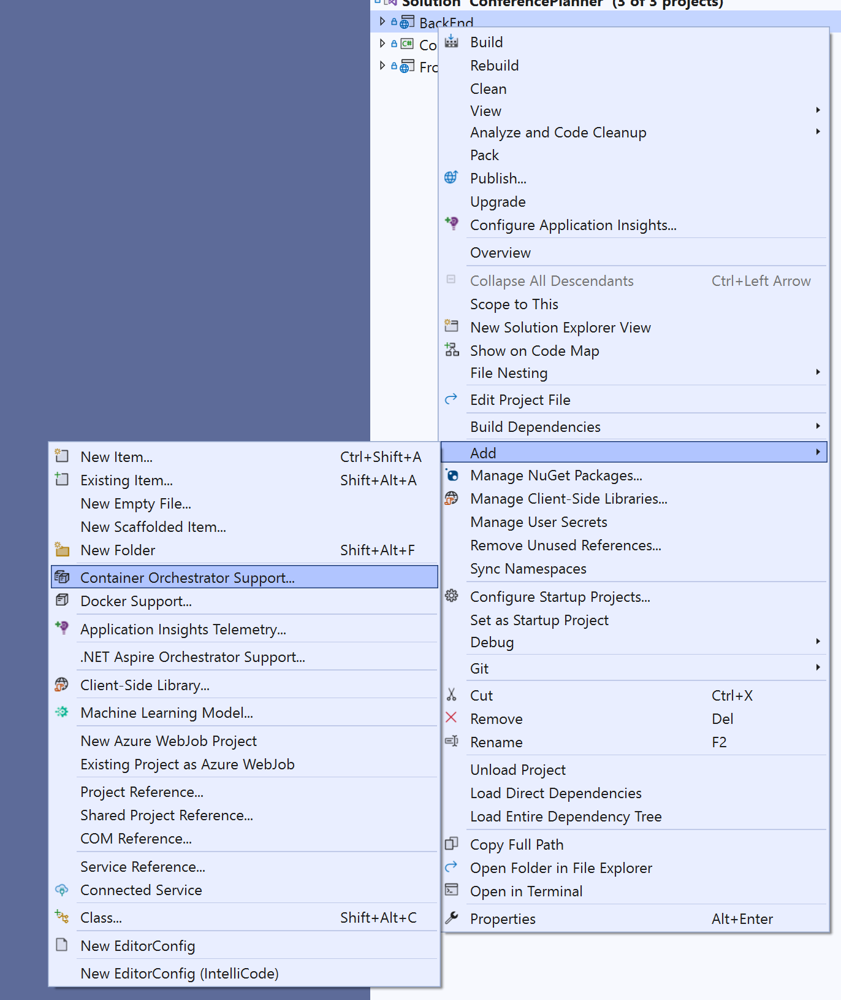
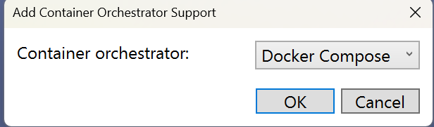
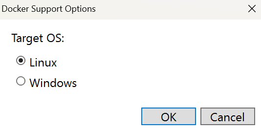
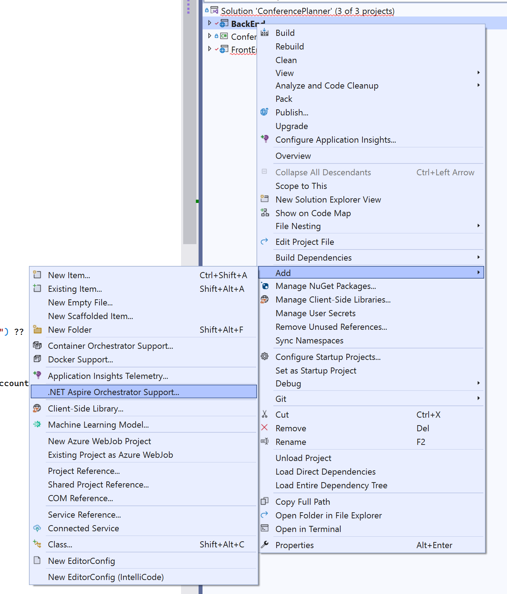
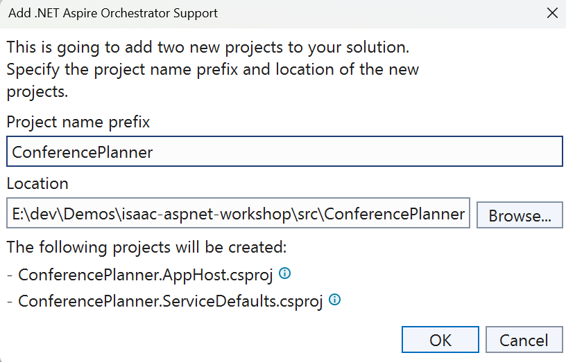
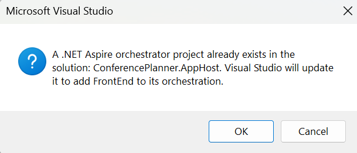

# Containerization / Aspire

> **Note** To perform the steps in this part of the workshop, you will need Docker installed on your machine, as well as `docker compose`. If you can, it is highly recommended to install [Docker Desktop](https://www.docker.com/products/docker-desktop/).

Now that we have a fully working conference management application, we can start to think about how this app would need to run when deployed to production. We can deploy both apps separately, but than we are responsible for handling how the Blazor app calls the Api (which honestly is a pain). One approach to reduce this complexity (and make your app run at a lesser cost) is to run your apps in containers. We could talk for an entire day about containers, so let's pretend we know enough about containers to be dangerous.

## Containerizing ASP.NET Core with Docker

One way to containerize your app is with Docker. Docker is pretty handy because the tooling for it with Visual Studio is quite good. Let's go through the process needed to configure our app to run in Docker.

1. Right-Click on the `BackEnd` project and choose `Container Orchestration Support`

    

2. Choose `Docker Compose` as the container orchestrator.

    

3. Choose `Linux` as the Target OS:

    

4. You will see a new project is created called `docker-compose` and a `Dockerfile` is added to your `BackEnd` project.

5. Complete the same steps for the `FrontEnd` project.

    Now we can start to update our app to run in containers.

6. In the `docker-compose` project, there is a file that is used by Visual Studio to configure the docker-compose call to build our containers. Update the contents of `docker-compose.override.yml` to the following:

    ```yml
   version: '3.4'

   services:
     backend:
       environment:
         - ASPNETCORE_ENVIRONMENT=Development
         - ASPNETCORE_HTTP_PORTS=8080
         - ASPNETCORE_HTTPS_PORTS=8081
       ports:
         - "5432:8080"
         - "5433:8081"
       volumes:
         - ${APPDATA}/Microsoft/UserSecrets:/home/app/.microsoft/usersecrets:ro
         - ${APPDATA}/ASP.NET/Https:/home/app/.aspnet/https:ro
       extra_hosts:
           - "host.docker.internal:host-gateway"
     frontend:
       environment:
         - ASPNETCORE_ENVIRONMENT=Development
         - ASPNETCORE_HTTP_PORTS=8080
         - ASPNETCORE_HTTPS_PORTS=8081
         - ServiceUrl=http://host.docker.internal:5432
       ports:
         - "5434:8080"
         - "5435:8081"
       volumes:
         - ${APPDATA}/Microsoft/UserSecrets:/home/app/.microsoft/usersecrets:ro
         - ${APPDATA}/ASP.NET/Https:/home/app/.aspnet/https:ro
       extra_hosts:
           - "host.docker.internal:host-gateway"
    ```

To allow our 2 different apps (which will be running in separate containers) to communicate, we perform some port mapping, set the host-gateway to `host.docker.internal` (this is to allow the FrontEnd container to reach the Backend). And update our `ServiceUrl` (which is stored in `appsettings.json` previously) environment variable to the `http` endpoint of the `BackEnd` project.

7. Notice that we are calling the Api over the http endpoint. To allow this, we will need to make a change to the `BackEnd` project to not force HttpsRedirection. Update the contents of `Program.cs` in the `BackEnd` project so the `app.UseHttpsRedirection()` extension is commented out:

   ```csharp
   //app.UseHttpsRedirection();
   ```

    We should now be able to run the `Docker Compose` project in Visual Studio and our containers will build and run and we will be able to validate our app now works running in containers.

## Using .NET Aspire to Containerize our App

You notice above that there were some steps that we had to do to allow our containers to talk to each other. Let's look at a different way to have our app run in containers without having to do this.

As of May of 2024, the .NET team has made .NET Aspire generally available which means it can be run in production. .NET Aspire is an opinionated, cloud ready stack for building observable, production ready, distributed applications (that is from the [official docs](https://learn.microsoft.com/en-us/dotnet/aspire/get-started/aspire-overview) 😀). One of the biggest benefits to .NET Aspire is to simplify how we build applications that have multiple pieces and can be quite complex. Our app isn't very complicated, but if this was to run in the cloud we might want to add Aspire to make it more resilient.


### Add Aspire Support

1. Right-Click on the `BackEnd` project and choose `.NET Aspire Orchestrator Support`

    

2. Give a project name prefix and location

    

3. Two new projects will be created, `ConferencePlanner.AppHost` and `ConferencePlanner.ServiceDefaults`

4. Right-Click on the `FrontEnd` project and choose `.NET Aspire Orchestrator Support`. You will be asked if you want to add it to the same orchestration

    

    Now we have all the Aspire bits setup. Now we can setup our app to run with Aspire.

###


##

**Previous**: [Session #6 - Final Touches](/docs/6.%20Final%20Touches.md) | **Next**: [Session #8 - Challenges](/docs/8.%20Challenges.md)

